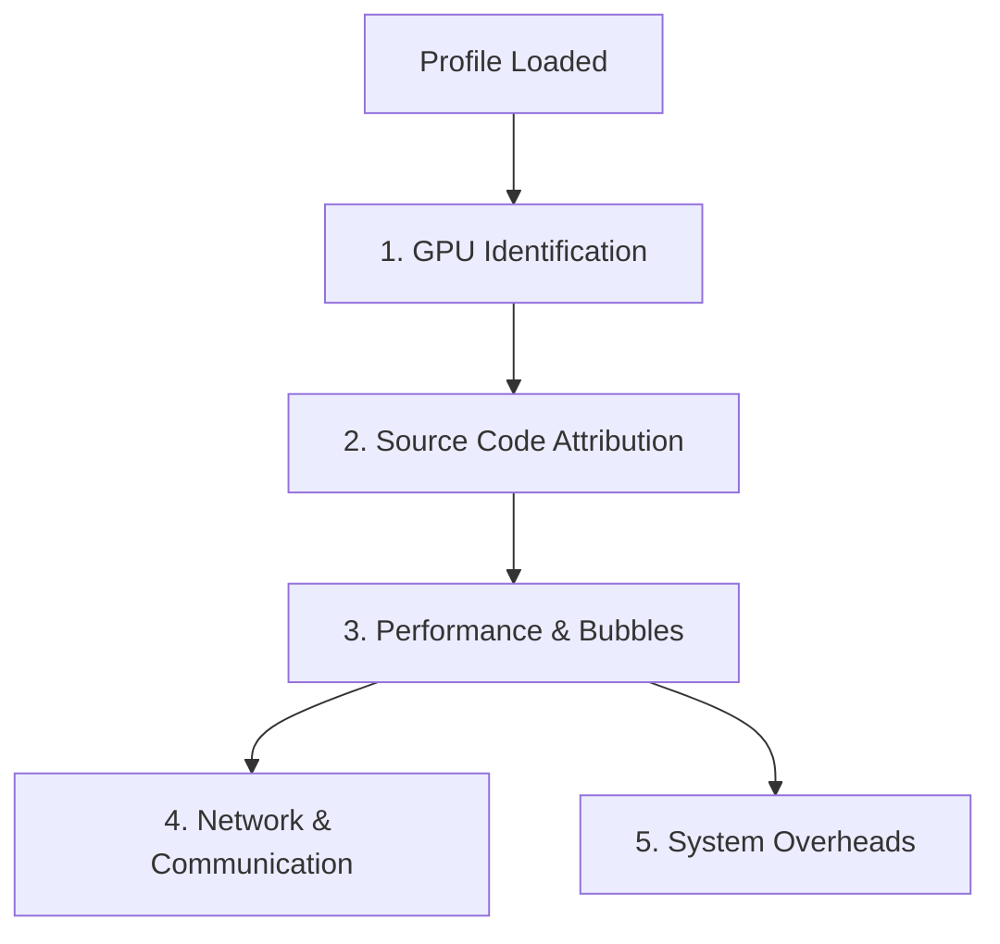

# GPU Profiling — Problem Taxonomy

> The 5 categories of problems that nsys-ai helps researchers solve when analyzing Nsight Systems profiles.

## Problem Flow

---

### Problem 1: GPU Identification & Association

**The question:** "Which GPU is which? Which stream maps to which device?"

| Aspect | Detail |
|--------|--------|
| **Why it matters** | Multi-GPU profiles show lanes by `deviceId` — researchers need to map these to physical GPUs |
| **SQLite tables** | `TARGET_INFO_GPU`, `CUPTI_ACTIVITY_KIND_KERNEL.deviceId` |
| **nsys-ai coverage** | `info` shows GPU hardware; `summary --gpu N` filters by device; `timeline --gpu N` shows per-device view |

---

### Problem 2: Source Code Attribution

**The question:** "Where in the source code does this kernel come from?"

| Level | Difficulty | Approach |
|-------|-----------|----------|
| **(a) NVTX ranges → kernels** | Easy | nsys-ai `tui` shows NVTX hierarchy with kernel children |
| **(b) Kernel name → framework op** | Medium | `search` by kernel name, cross-reference with PyTorch ops |
| **(c) Python callstack → kernel** | Hard | Requires `--cudabacktrace=all` + `--python-backtrace=cuda` at profile time |

**nsys-ai coverage:**
- `tui` and `tree` show NVTX → kernel mapping
- `search` finds kernels by name pattern
- `timeline` shows NVTX hierarchy bars above kernel lanes
- AI `annotator.py` suggests NVTX annotations for un-annotated code

---

### Problem 3: Performance & Bubbles

**The question:** "Are there idle gaps? Is the kernel time reasonable?"

| Sub-problem | Detection | nsys-ai Command |
|-------------|-----------|-----------------|
| **GPU idle gaps ("bubbles")** | Gaps between kernel executions on a stream | `timeline` (visual), `summary` (aggregate stats) |
| **Iteration variance** | Some iterations slower than others | `iters` (auto-detect iterations) |
| **Kernel hotspots** | Single kernel dominating total time | `summary` (top-N kernels by total/avg duration) |
| **Pipeline stalls** | Forward finishes, backward hasn't started | `tui` (NVTX range gaps), `timeline` (visual) |

---

### Problem 4: Network & Communication Imbalance

**The question:** "Why is AllReduce taking so long? Are GPUs misaligned?"

| Sub-problem | Detection | nsys-ai Command |
|-------------|-----------|-----------------|
| **NCCL overhead** | Total time in collective ops vs compute | `overlap` (compute/NCCL overlap %) |
| **Collective breakdown** | Which NCCL op types dominate | `nccl` (per-type summary) |
| **Compute-comm overlap** | Is NCCL running concurrently with compute? | `overlap` (overlap analysis) |

---

### Problem 5: Stream Overlap & System Overheads

**The question:** "Are streams overlapping correctly? Are there hidden overheads?"

| Sub-problem | Detection | nsys-ai Command |
|-------------|-----------|-----------------|
| **Stream concurrency** | Multiple streams running in parallel | `timeline` (visual — multiple stream rows) |
| **False serial execution** | Streams that should overlap but don't | `timeline` (look for sequential patterns) |
| **Cross-stream coordination** | Event/sync dependencies between streams | `tui` (per-stream kernel sequence) |

---

## Coverage Summary

| Capability | Status | nsys-ai Command |
|-----------|--------|-----------------|
| GPU identification | ✅ | `info`, `summary --gpu N` |
| NVTX → kernel mapping | ✅ | `tui`, `tree`, `timeline` |
| Kernel search | ✅ | `search` |
| Idle gap detection | ✅ | `timeline`, `summary` |
| Iteration detection | ✅ | `iters` |
| NCCL overhead | ✅ | `overlap`, `nccl` |
| Stream visualization | ✅ | `timeline` |
| AI auto-commentary | ✅ | `summary` (with `[ai]` extra) |
| NVTX annotation suggestions | ✅ | AI `annotator` module |
| Backtrace resolution | 🔴 | Not yet — needs profile-time flags |
| Kernel efficiency vs peak | 🔴 | Not yet — needs GPU metrics |
| Multi-rank alignment | 🔴 | Not yet — needs multi-file loading |
