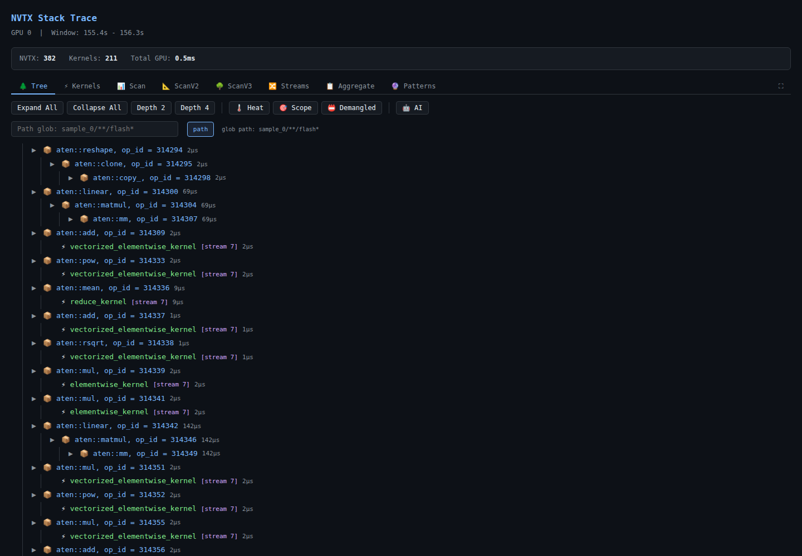
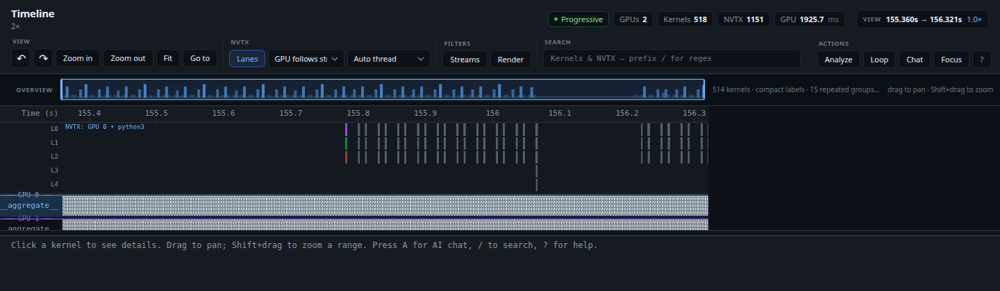
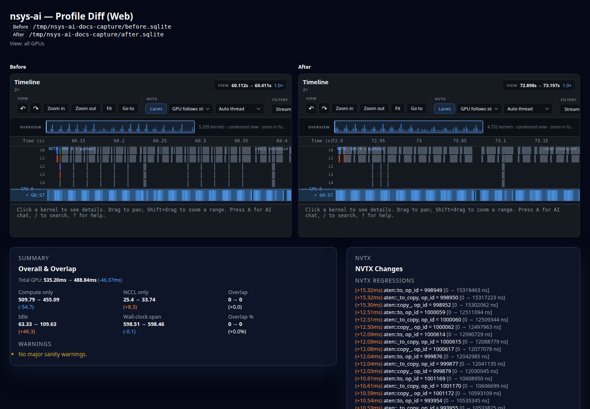

# Choosing a viewer

nsys-ai has one entry point and five surfaces behind it. They all run locally
and accept the same profile inputs; choose the surface that matches the question
rather than starting every server.

Start with `open` when you do not yet know which surface you want:

| Command | What it shows | Use it when |
|---|---|---|
| `nsys-ai open PROFILE` | The `web` viewer, browser launched for you | You just want to look at a capture and have no reason to pick |
| `nsys-ai open PROFILE --viewer tui` | The NVTX tree TUI over the full span | You are on a remote shell, or a browser is not worth starting |

The named surfaces, when the question is already specific:

| Command | What it shows | Use it when |
|---|---|---|
| `nsys-ai web PROFILE` | NVTX tree viewer with lazy tree requests | You want to browse nested ranges and the kernels attributed to them |
| `nsys-ai timeline-web PROFILE` | Progressive multi-GPU horizontal timeline | You want streams, kernels, NVTX lanes, search, and a session-backed workflow |
| `nsys-ai diff-web BEFORE AFTER` | Before/after comparison shell with two timeline views | You want to inspect a change and its canonical diff side by side |
| `nsys-ai tui PROFILE --gpu N --trim START_S END_S` | NVTX tree TUI | You want the tree in the terminal and already know the window |
| `nsys-ai timeline PROFILE --trim START_S END_S` | Horizontal timeline TUI | You want the timeline in the terminal and already know the window |

The commands are separate transports over the same profile and diff contracts.
The older `nsys-ai perfetto` server is not one of the choices; use
`nsys-ai export` when you need a Chrome Trace Event JSON file instead.

## See the difference

The same committed fixture makes the three surfaces easy to compare:

### NVTX tree: `web`



### Horizontal timeline: `timeline-web`



### Pair comparison: `diff-web`



These are documentation captures, not terminal-output screenshots. See the
[image capture notes](../images/README.md) for the fixture, viewport, and
regeneration commands.

## NVTX tree: `web`

Use this for hierarchy-first investigation:

```console
$ nsys-ai web PROFILE.sqlite --port 8142
```

The server prints the URL and builds the NVTX tree in the background. The root
page is the interactive tree viewer; `GET /api/tree` returns a bounded tree
slice. `depth`, `limit`, and `max_nodes` bound the response, and a truncated
response carries `has_more` / `children_total` metadata rather than pretending
that a high-fan-out node is complete.

`web` selects one GPU when `--gpu` is omitted. Use this surface when the useful
question is “which ranges contain this work?” rather than “how do all streams
overlap over time?”.

## Horizontal timeline: `timeline-web`

Use this for a progressive, multi-GPU timeline:

```console
$ nsys-ai timeline-web PROFILE.sqlite --port 8144 --no-browser
```

The initial HTML shell is served while the NVTX data is prepared in the
background. The client reads profile metadata from `/api/meta` and requests
time tiles from `/api/data?start_s=START&end_s=END`. The query values are
seconds on the Nsight capture clock, not indexes and not nanoseconds.

This surface owns the browser loop UI and can open a session handoff:

```console
$ nsys-ai timeline-web PROFILE.sqlite --session /tmp/nsys-ai/run-001
```

Use `--findings FINDINGS.json` or `--auto-analyze` when you want evidence
overlays. Use the [guided loop setup](../guided-loop-setup.md) for the full
diagnose → propose → re-profile → diff → decide path.

## Pair comparison: `diff-web`

Use this after you have two captures:

```console
$ nsys-ai diff-web BEFORE.sqlite AFTER.sqlite --port 8145 --no-browser
```

The shell exposes the canonical pair metadata at `/api/diff/meta` and the
deterministic summary at `/api/diff/summary`. The two embedded timeline views
are read-only inspection surfaces; record a decision through the session-aware
CLI or the session loop rather than treating a browser colour as the decision.

`--gpu` restricts both sides to one device. Without it, the comparison remains
all-GPU, matching `nsys-ai diff`.

## Terminal viewers: `tui` and `timeline`

Both render one window at a time rather than streaming tiles, so both require
`--trim`; `tui` also requires `--gpu`. They do not appear in the `nsys-ai --help`
command table — they are listed under its `also available:` footer, along with
the other text-report commands.

```console
$ nsys-ai tui PROFILE.sqlite --gpu 0 --trim 39 42
$ nsys-ai timeline PROFILE.sqlite --gpu 0 --trim 39 42
```

`nsys-ai open PROFILE --viewer tui` is the same tree browser without the window
arguments: it resolves the full profile span and the first GPU for you. Reach for
the explicit commands when you want a specific window, and for `timeline-web`
when the capture spans more GPUs than one terminal can usefully show.

## Shared operational rules

- `--no-browser` is useful on a remote host or in an automated smoke test; the
  command still prints the local URL.
- A requested port may be replaced with a free local port when it is already
  occupied. Use the URL printed by the process, not a hard-coded port.
- Use `nsys-ai doctor PROFILE` before a large `.nsys-rep` analysis. It reports
  whether conversion, cache, and schema checks are ready.
- For a trace file rather than an interactive service, run:

  ```console
  $ nsys-ai export PROFILE.sqlite --trim START_S END_S -o trace-export/
  ```

See [profile inputs](profile-inputs.md), [time windows](time-windows.md), and
[known limits](known-limits.md) before interpreting a partial or incomparable
view.
